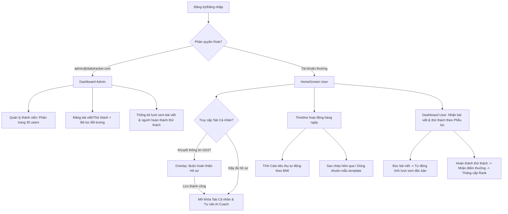

# DailyTracker - Hướng dẫn & Danh sách tính năng (Instruction)

Tài liệu này tóm tắt toàn bộ các tính năng đã được xây dựng và hoàn thiện trong dự án **DailyTracker** (phiên bản cập nhật mới nhất), phân chia chi tiết giữa phân hệ Người dùng (User) và Quản trị viên (Admin).

---

## 📊 THÔNG SỐ HỆ THỐNG (SYSTEM CONFIGURATIONS)

### 1. Phân loại Cấp bậc & Điểm số tích lũy (Rank Levels)
Hệ thống sử dụng điểm số (Points) tích lũy được từ việc hoàn thành thử thách để đánh giá cấp bậc của người dùng. Cụ thể:
* **Sắt (Iron)**: 0 - 499 điểm.
* **Đồng (Bronze)**: 500 - 1499 điểm.
* **Vàng (Gold)**: 1500 - 3999 điểm.
* **Bạch Kim (Platinum)**: 4000 - 7999 điểm.
* **Kim Cương (Diamond)**: 8000 - 14999 điểm.
* **Cao Thủ (Master)**: Từ 15000 điểm trở lên.

*Đặc quyền thăng hạng*: Khi thăng hạng, giao diện Cá nhân sẽ tự động đổi màu sắc nền theo dải màu Gradient độc quyền tương ứng của Rank đó để tăng tính khích lệ.

### 2. Phân loại Chỉ số cơ thể (BMI Categories)
Chỉ số BMI (Body Mass Index) được tính tự động theo công thức:
$$\text{BMI} = \frac{\text{Cân nặng (kg)}}{\left(\text{Chiều cao (m)}\right)^2}$$

Dựa trên chỉ số này, hệ thống phân loại thể trạng người dùng làm 4 mức cốt lõi:
* **Thiếu cân (Underweight)**: $\text{BMI} < 18.5$ (Mã màu hiển thị: Xanh dương - Info).
* **Bình thường (Normal)**: $18.5 \le \text{BMI} < 25.0$ (Mã màu hiển thị: Xanh lá - Success).
* **Thừa cân (Overweight)**: $25.0 \le \text{BMI} < 30.0$ (Mã màu hiển thị: Vàng - Warning).
* **Béo phì (Obese)**: $\text{BMI} \ge 30.0$ (Mã màu hiển thị: Đỏ - Error).

---

## 🛠️ THƯ VIỆN ĐÃ SỬ DỤNG (DEPENDENCIES)

Hệ thống được phát triển trên Flutter SDK, tích hợp các thư viện chuyên dụng sau:
1. **Firebase Core (`firebase_core`)**: Khởi tạo và cấu hình dịch vụ Firebase.
2. **Firebase Auth (`firebase_auth`)**: Xác thực và quản lý tài khoản người dùng/admin bảo mật.
3. **Cloud Firestore (`cloud_firestore`)**: Cơ sở dữ liệu đám mây NoSQL lưu trữ dữ liệu người dùng, bài đăng, thử thách, hoạt động thời gian thực.
4. **Firebase Storage (`firebase_storage`)**: Lưu trữ tệp tin hình ảnh tải lên từ bài viết của Admin.
5. **Sqflite (`sqflite`)**: Cơ sở dữ liệu SQLite cục bộ phục vụ bộ nhớ đệm ngoại tuyến.
6. **Provider (`provider`)**: Quản lý trạng thái ứng dụng toàn cục (Xác thực, Giao diện tối/sáng, Đa ngôn ngữ).
7. **Flutter Animate (`flutter_animate`)**: Xây dựng hiệu ứng chuyển động vi mô (Micro-animations) mượt mà cho UI.
8. **FL Chart (`fl_chart`)**: Vẽ biểu đồ trực quan hóa dữ liệu Calo tiêu thụ hàng ngày.
9. **Lottie (`lottie`)**: Tích hợp các tệp hoạt họa vector chất lượng cao.
10. **Table Calendar (`table_calendar`)**: Xây dựng lịch biểu lựa chọn ngày linh hoạt.
11. **Flutter Slidable (`flutter_slidable`)**: Thiết kế thao tác vuốt trượt để xóa/sửa hoạt động.
12. **Image Picker (`image_picker`)**: Chọn tệp tin hình ảnh từ thư viện thiết bị hoặc camera.
13. **HTTP (`http`)**: Hỗ trợ thực hiện các API request, đặc biệt là gửi ảnh lên Catbox.moe làm phương án dự phòng (Fallback upload).
14. **Intl (`intl`)**: Định dạng ngày tháng hiển thị và tiền tệ, hỗ trợ đa ngôn ngữ.
15. **Google Fonts (`google_fonts`)**: Cung cấp font chữ hiện đại (Outfit, Inter) thay thế font mặc định của hệ điều hành.

---

## 🔄 LUỒNG VẬN HÀNH (OPERATIONAL FLOW)

### 1. Luồng phân quyền và điều hướng đăng nhập
* Tài khoản có email là `admin@dailytracker.com` và mật khẩu `admin123` được hệ thống tự động gán quyền `admin` ngay khi đăng nhập.
* Admin sẽ được điều hướng vào màn hình Dashboard riêng biệt, vô hiệu hóa thanh Bottom Navigation dành cho User.
* Các tài khoản thông thường sẽ được phân quyền `user` và chuyển vào giao diện chính gồm 5 tab.

### 2. Luồng bảo mật và ràng buộc hoàn thiện hồ sơ (User)
* Khi người dùng đăng ký, nếu họ bỏ qua việc cung cấp thông tin cân nặng, chiều cao ở Giai đoạn 2 (để đăng ký nhanh):
  * Mỗi khi họ nhấn chọn tab **Cá nhân** (Profile), màn hình chính sẽ bị khóa bởi một Form bắt buộc.
  * Form này yêu cầu nhập đầy đủ: Giới tính, Tuổi, Chiều cao, Cân nặng và Quốc gia.
  * Khi nhấn **Lưu & Tiếp tục**, ứng dụng gọi phương thức `updateProfile` lưu lên Firestore, sau đó gọi `refreshUser()` để tải lại thông tin.
  * Khi các thông tin trên không còn null, giao diện tab Cá nhân sẽ tự động mở khóa và hiển thị bình thường.

### 3. Luồng phân phối bài viết và thử thách theo phễu lọc (Phễu đối tượng)
* Khi Admin tạo một Bài viết hoặc Thử thách mới:
  * Admin có quyền lọc đối tượng nhận theo: Quốc gia, Rank, Giới tính, hoặc mức BMI. Nếu để trống bộ lọc nào, hệ thống coi như áp dụng cho tất cả đối tượng ở thuộc tính đó.
* Khi User tải Dashboard hoặc tab khám phá:
  * Hệ thống so sánh thông tin cá nhân của User với các bộ lọc tiêu chí của Bài viết/Thử thách.
  * Chỉ các nội dung thỏa mãn tất cả tiêu chí phễu lọc mới hiển thị trên giao diện của User đó.

### 4. Luồng tính toán Calo và Lịch trình Timeline (User)
* Khi User thêm hoạt động trên Timeline:
  * Hệ thống dựa trên Danh mục của hoạt động (vd: Thể dục, Ăn uống) và thời gian thực hiện để ước tính Calo tiêu thụ.
  * Chỉ số BMI của User được đưa vào công thức nhân hệ số để tính ra lượng calo tiêu hao cá nhân hóa cao nhất.
  * User có thể đánh dấu hoàn thành hoạt động để cập nhật biểu đồ cột năng lượng hàng ngày.

### 5. Luồng ghi nhận Lượt xem độc bản (Post View) & Hoàn thành thử thách (User - Admin)
* **Lượt xem bài viết**: 
  * Khi User hiển thị bài viết trên Dashboard, ứng dụng gọi `FirestoreService.instance.viewPost(postId, userId)`.
  * Firestore sẽ thêm UID của user vào mảng `viewedUserIds` trên tài liệu bài viết bằng `FieldValue.arrayUnion`. Việc này đảm bảo lượt xem được tính là duy nhất (unique).
  * Admin Dashboard đọc độ dài mảng `viewedUserIds` để hiển thị chính xác tổng số lượt xem.
* **Hoàn thành thử thách**:
  * Khi User hoàn thành thử thách, hệ thống lưu bản ghi vào bảng `user_challenges`.
  * Điểm thưởng (Points) của thử thách được cộng trực tiếp vào tổng điểm của User, tự động cập nhật Rank mới nếu chạm các mốc điểm.
  * Ở phía Admin, mỗi thẻ thử thách hiển thị số lượng người hoàn thành bằng cách chạy lệnh đếm tài liệu `user_challenges` có `challengeId` tương ứng (`.count().get()`).

---

## 👤 PHÂN HỆ CHI TIẾT CỦA NGƯỜI DÙNG (USER PORTAL)

### 1. Dashboard & Thống kê hàng ngày
* Hiển thị calo, nước uống và thời gian tập luyện.
* Hiển thị danh sách thử thách thích hợp hôm nay.
* Hiển thị tin tức thích hợp.

### 2. Timeline hoạt động
* Biểu diễn hoạt động theo giờ.
* Thêm hoạt động, sao chép lịch trình ngày hôm trước.
* Gợi ý top 5 hoạt động thường xuyên nhất trong 30 ngày.
* Lưu và áp dụng nhanh khuôn mẫu hoạt động (Activity Templates).

### 3. AI Coach Chat
* Nhận tư vấn trực tiếp từ AI bằng tiếng Việt / tiếng Anh dựa trên chỉ số BMI thực tế của người dùng.

### 4. Profile & Thiết lập
* Thăng tiến Rank hiển thị bằng màu sắc Gradient sang trọng.
* Tính BMI tự động và gán mác thể trạng (Thiếu cân, Thừa cân...).
* Chỉnh sửa nhanh cân nặng, chiều cao.
* Cài đặt Sáng/Tối và Đa ngôn ngữ (Anh/Việt).

### 5. Bảng xếp hạng vinh danh
* Top 3 người dùng đứng đầu được hiển thị bục Podium đặc biệt.

---

## 🛡️ PHÂN HỆ CHI TIẾT CỦA QUẢN TRỊ VIÊN (ADMIN PORTAL)

### 1. Dashboard thống kê tổng quan
* Thống kê tổng số thành viên, tổng điểm tích lũy hệ thống và tổng bài viết hiện có.

### 2. Quản lý thành viên (Member List)
* Phân trang danh sách thành viên (mỗi trang **30 users**) bằng dải nút chọn trang (1, 2, 3...) đẹp mắt, tránh tải danh sách dài gây lag thiết bị.
* Tìm kiếm thành viên theo Tên, Email, Quốc gia.

### 3. Đăng bài viết & Thử thách
* Tải ảnh lên Firebase Storage với fallback tự động sang Catbox.moe.
* Bộ lọc phễu thông minh gửi đến các nhóm đối tượng cụ thể (Quốc gia, Rank, Giới tính, BMI).
* **Đo lường hiệu quả**:
  * Đọc số lượt xem độc bản (views) của từng bài viết.
  * Đọc số người hoàn thành thực tế của từng thử thách bằng Firestore count hiệu năng cao.
